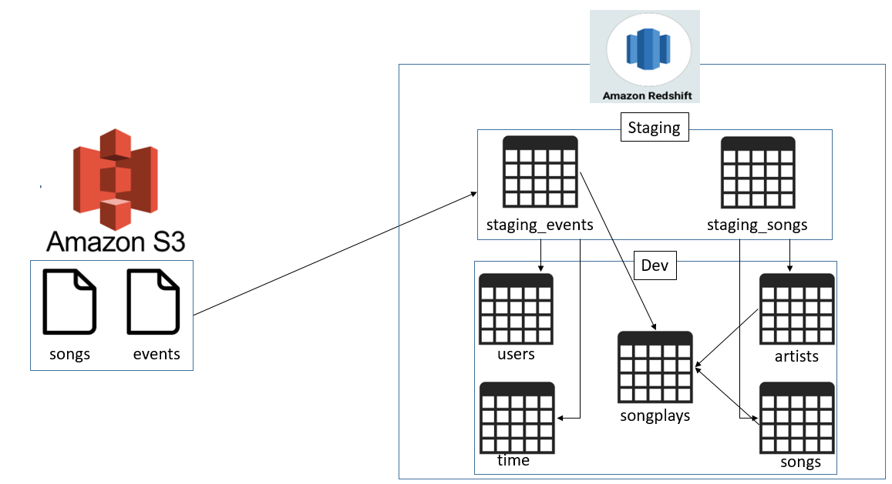

# Data Warehouse with AWS Redshift

## Description
---
This data ETL pipeline populates the sparkifydb database in AWS Redshift.  
- This database enables the music  company, Sparkify, to answer business questions it may have of its users, their choice of songs, and the artists of those songs using the data stored in the sparkifydb logs and files.
- The database provides a consistent and reliable source to store this data.

* The data will be useful in helping Sparkify reach some of its analytical goals, for example, finding out songs that have highest popularity or times of the day which is high in traffic.

## Why Redshift?
--- 
* Amazon Redshift uses SQL to analyze structured and semi-structured data across data warehouses, operational databases, and data lakes, using AWS-designed hardware and machine learning to deliver the best price performance at any scale.
 

## Database Design
---
* For the schema design, the STAR schema is used as it simplifies queries and provides fast aggregations of data.

* `songplays` is the facts table while `users`, `artists`, `songs` and `time` the dimension tables.

## Data Pipeline design
* For the ETL pipeline, Python is used as it contains libraries such as pandas, that simplifies data manipulation. It also allows connection to Postgres Database.

* There are 2 types of data involved, song and log data. For song data, it contains information about songs and artists, which we extract from and load into users and artists dimension table

* First, we load song and log data from JSON format in S3 into our staging tables (staging_songs_table and staging_events_table)

* Next, we perform ETL using SQL, from the staging tables to our fact and dimension tables. Below shows the architectural design of this pipeline:

## Files
---
* create_tables.py is the python script that drops all tables and create all tables (including staging tables)

* sql_queries.py is the python file containing all SQL queries. It is called by create_tables.py and etl.py

* etl.py script loads data into staging tables, then inserts data into fact and dimension tables from staging tables.

* dwh.cfg contains configurations infomation for Redshift database.

* redshift_setup.py sets up the redshift cluster and creates an IAM role for redshift to access other AWS services.

* redshift_teardown.py removes the redshift cluster and the associated IAM role.

## Running the ETL Pipeline
---
* First, run redshift_setup.py to set up the Redshift cluster and IAM role.

* Then run create_tables.py to create the tables specified in the in the sql_queries.py file. If tables were created previously, they will be dropped and recreated.

* Next, run etl.py to populate the tables created.